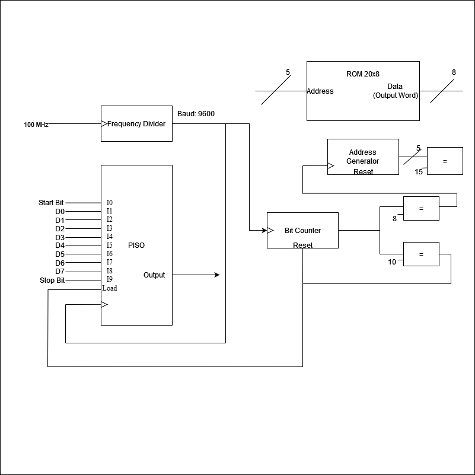
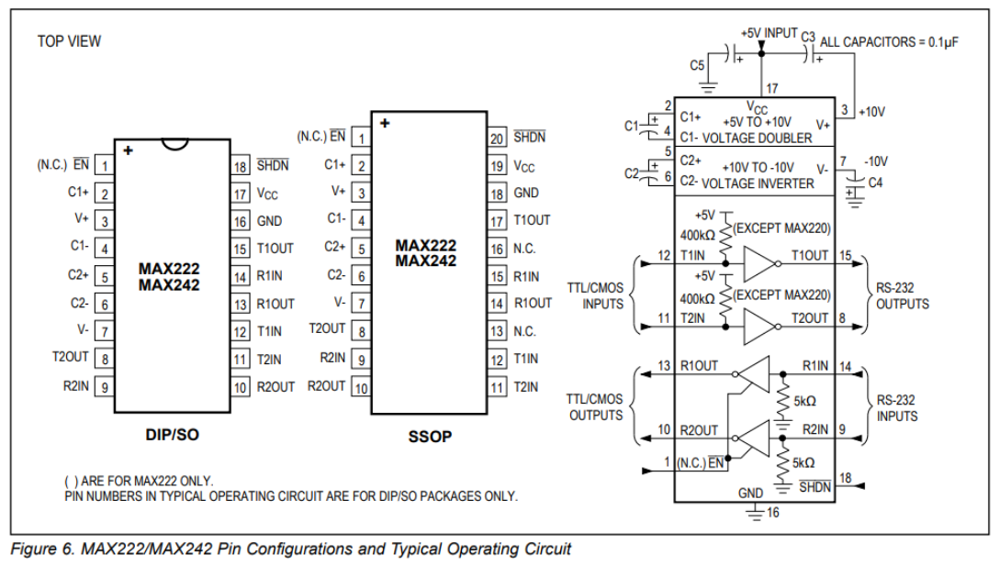
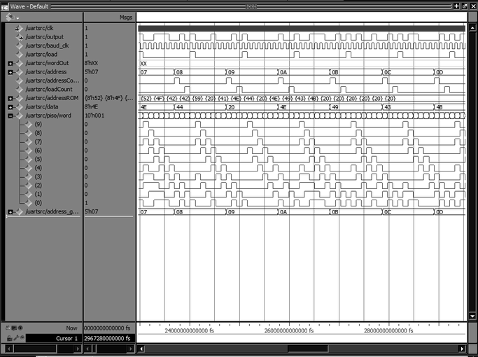
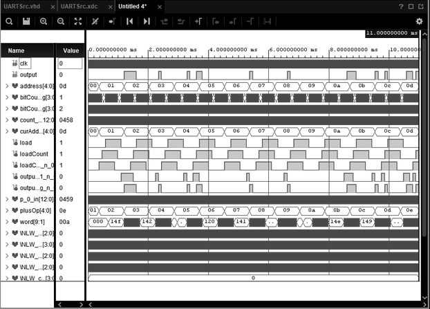
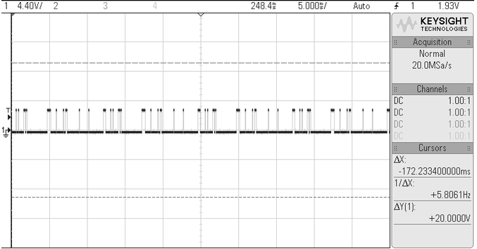
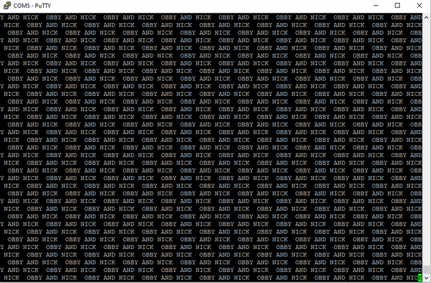

# RS232_UART_Transmitter

>Create a basic UART capable of transmitting 9600 N81 over a RS232 communications channel 

---------------------------------------------------------------------------------------------------

For this project, the goal was to use an FPGA to create the digital logic of a UART (transmission specifically) and generate a RS-232 message which will be read into a terminal on the PC through a transceiver circuit. 

---------------------------------------------------------------------------------------------------

## Goals of Design
> Determine the major pieces to include

For Transmission:
1. Target a specific speed to build a baud rate generator/clock divider around
2. Framing bit adder (include start/stop bits)
3. Parity bit calculator (if parity is utilized, otherwise not necessary)
4. A register to hold byte
5. Status registers (busy/sent/idle)
6. Bit Serializer/PISO Shifting

For Receiving:
1. Start bit edge detector
2. Bit center detector
3. Parity checker
4. Status (buffer overrun, parity error, framing error)

* This design does not construct any receiving logic, and only completes a basic transmitter (missing status registers)

---------------------------------------------------------------------------------------------------

## Equipment Utilized 

[Digilent Basys 3 FPGA Board](https://digilent.com/reference/_media/basys3:basys3_rm.pdf)

[MAX 242 RS-232 Driver/Receiver Chip](https://www.analog.com/media/en/technical-documentation/data-sheets/MAX220-MAX249.pdf)

[Keysight DSOX2024A Oscilloscope](https://www.keysight.com/us/en/assets/7018-02733/data-sheets/5990-6618.pdf)

## Software Utilized  

[Xilinx Vivado](https://docs.xilinx.com/search/all?content-lang=en-US)

[QuestaSim 2022.2](https://static.sw.cdn.siemens.com/siemens-disw-assets/public/QzFgMxW5gizEDRIAZYTQE/en-US/Siemens-SW-QuestaSim-FS-85329-D5.pdf)

[puTTY Terminal Program](https://www.putty.org/)

---------------------------------------------------------------------------------------------------

## Reference Images

Figure 1: RS232 UART (Transmission) Logic Design 

Figure 2: MAX 242 Transceiver Circuit to Transmit According to RS232 Spec (From Data Sheet)

---------------------------------------------------------------------------------------------------

## Results
Figure 3: Behavioral Simulation Testing 

>This figure shows the behavioral simulation waveforms. Of interest is the output signal, as well as word to ensure that the PISO is properly shifting through the data.

Figure 4: Post Synthesis and Implementation 

>This figure verifies the behavior remains consistent from behavioral simulation, and that it is ready to be downloaded onto a board. 

Figure 5: Oscilloscope Readings

>This figure verifies that the board is able to output RS232 communication. Without the transceiver circuit, it does not follow RS232 spec, but this is okay for quick verification that the board is functional. 

Figure 6: puTTY Terminal Output

>This figure shows the final output in puTTY when the transceiver circuit was constructed and connected in between the Basys 3 board and the PC. Now, the initial "B" is cut off, but the rest of the message remains intact, showing moderate success overall.
>One potential reason for the cutoff "B" might be due to the address generator not indexing correctly. Due to time constraints this could not be properly diagnosed, however. 